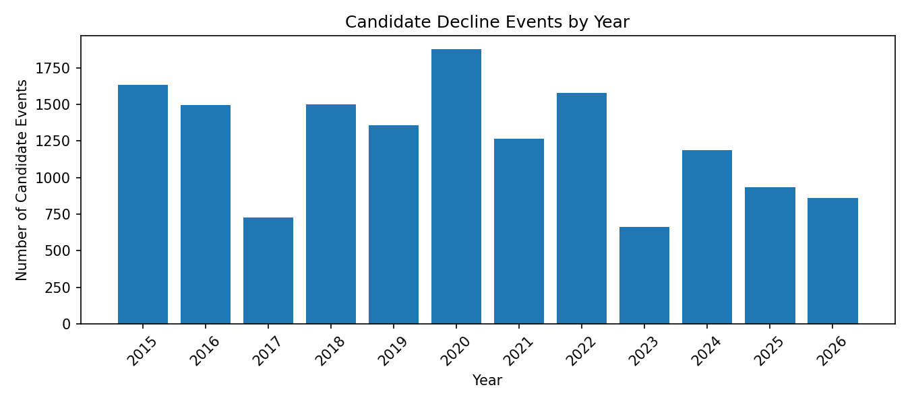
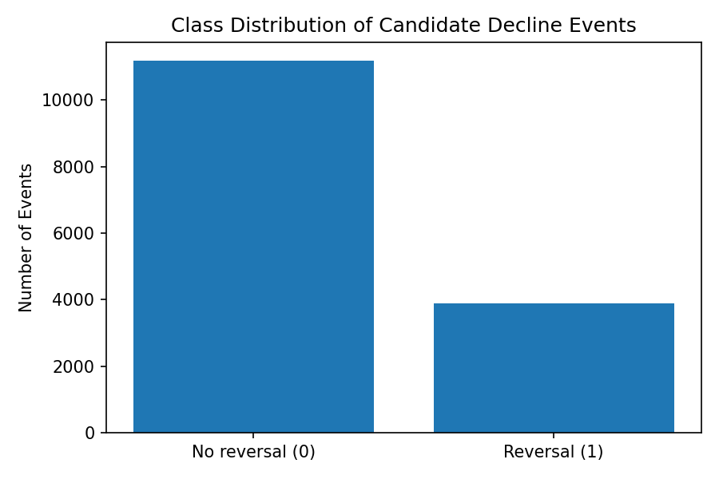
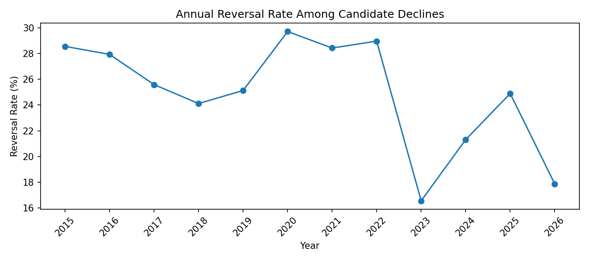
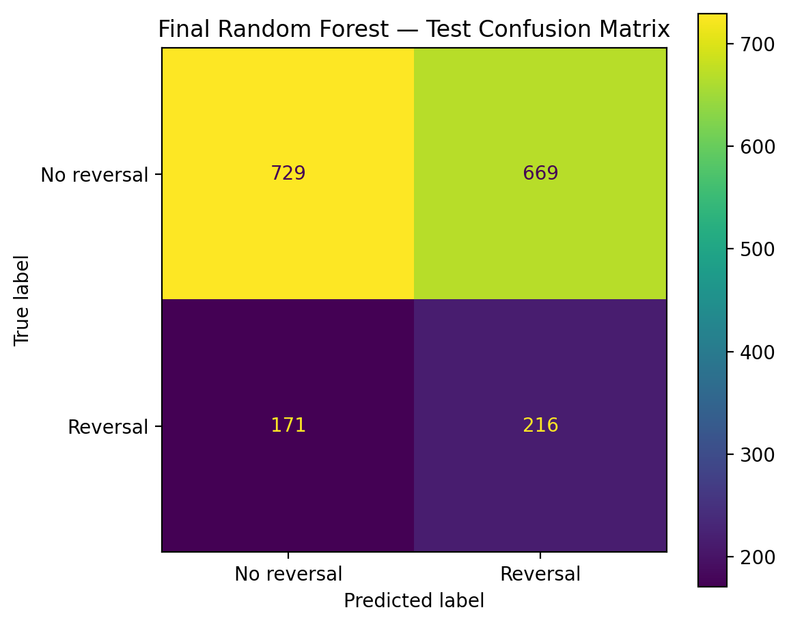
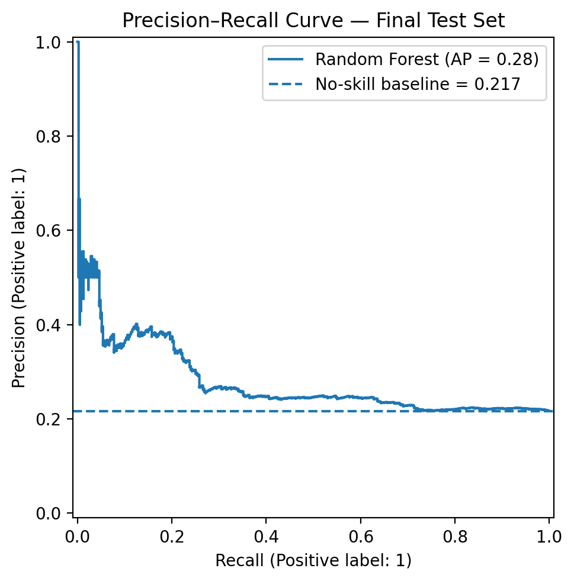
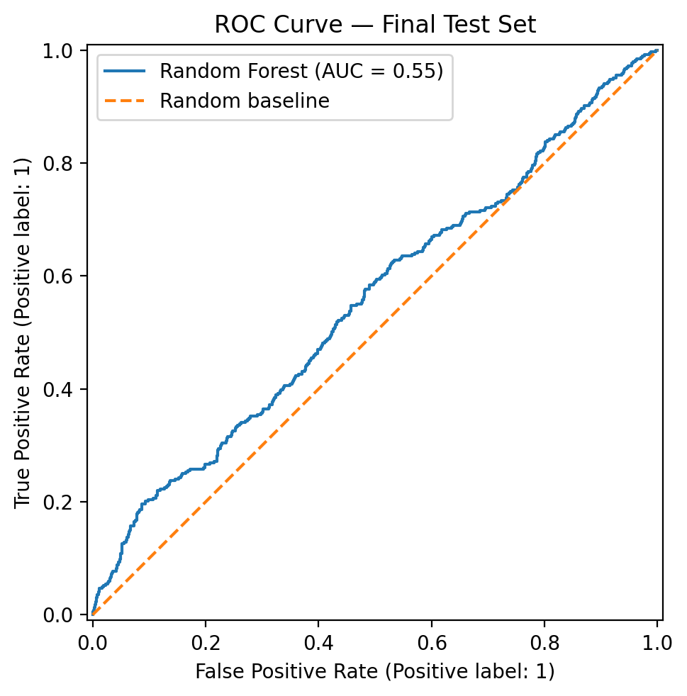
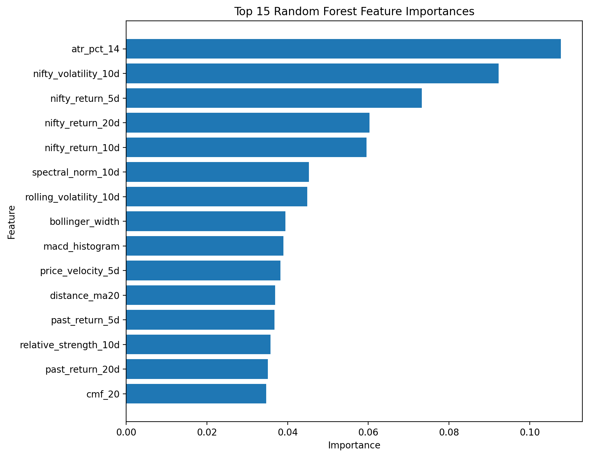

# NSE Stock Reversal Predictor

An end-to-end, leakage-aware machine learning pipeline for identifying potential **5-day price reversals after sharp declines** across 43 NSE large-cap stocks.

> **Note:** This project is a research-oriented screening model, not investment advice or an automated trading strategy.

---

## 1. Project Objective

After a stock falls sharply, some declines continue while others reverse quickly. The goal of this project is to identify decline events that are more likely to recover in the short term.

A candidate event is created when a stock falls by at least **5% over the previous 10 trading days**.

The classification target is:

| Label | Definition |
|---|---|
| `1` — Reversal | Stock gains at least **3% over the next 5 trading days** |
| `0` — No Reversal | Stock does not gain at least 3% over the next 5 trading days |

The objective is not to automatically buy every predicted stock. Instead, the model acts as a **candidate-screening tool** that ranks sharp-decline events for further analysis.

---

## 2. Why This Problem Matters

Short-term reversals are difficult to identify because price movement is noisy and depends on market regime, volatility, momentum, sector behavior, and stock-specific trading activity.

A naive approach such as “buy every stock after a 5% fall” is unreliable. This project tests whether technical indicators, volatility signals, market context, and mathematical features can improve the identification of potential reversal candidates.

---

## 3. Dataset

| Item | Details |
|---|---|
| Market | National Stock Exchange of India |
| Stock universe | 43 NSE large-cap stocks across multiple sectors |
| Data source | Yahoo Finance through `yfinance` |
| Date range | January 2015 to June 2026 |
| Raw observations | 121,775 daily OHLCV records |
| Final modelling events | 14,949 candidate decline events |

The project uses daily Open, High, Low, Close, Adjusted Close, and Volume data, along with NIFTY 50 market-index context.

One requested ticker, `TATAMOTORS.NS`, could not be downloaded consistently through Yahoo Finance and was excluded after validation. The final dataset retained 43 successfully downloaded stocks.

### Data Directory Structure

| Directory | Purpose |
|---|---|
| `data/raw/` | Individual stock and NIFTY OHLCV files downloaded through `yfinance` |
| `data/interim/` | Combined, validated, labelled, and intermediate datasets |
| `data/processed/` | Feature-engineered datasets and chronological train/validation/test splits |

The full data pipeline can be reproduced by running the notebooks in numerical order.

---

## 4. Exploratory Data Analysis

A total of **15,074 candidate decline events** were identified before final feature-null removal.

### Class Distribution

| Label | Events | Percentage |
|---|---:|---:|
| No Reversal | 11,179 | 74.16% |
| Reversal | 3,895 | 25.84% |

After removing rows with unavailable rolling-window features:

| Metric | Value |
|---|---:|
| Final modelling events | 14,949 |
| No Reversal events | 11,109 |
| Reversal events | 3,840 |
| Final reversal rate | 25.69% |

### Key EDA Findings

- Most candidate events occurred near the minimum decline threshold of **-5%**; deeper declines were less common.
- Reversal behavior varied by sector, showing that sector context may matter.
- Reversal rates changed meaningfully across years, indicating that market regimes influence short-term recovery behavior.
- The validation period had a lower reversal rate than the training period, reinforcing the need for chronological evaluation.
- Since only about one in four candidate events resulted in a reversal, **accuracy alone was misleading** and was not used as the primary model-selection metric.

The EDA showed that the problem is moderately imbalanced and regime-dependent, so the project focused on precision, recall, F1-score, ROC-AUC, and PR-AUC.

---

## 5. Feature Engineering

The final pipeline uses **22 numeric engineered features** plus the stock sector as a categorical feature.

### Price and Momentum Features

- 5-day, 10-day, and 20-day returns
- Price velocity
- Price curvature
- Distance from 20-day moving average
- RSI
- MACD histogram
- Bollinger Band position
- Bollinger Band width

### Volatility and Volume Features

- ATR percentage
- Rolling return volatility
- Volume ratio
- Chaikin Money Flow

### Market-Relative Features

- NIFTY 50 returns over 5, 10, and 20 days
- NIFTY 50 rolling volatility
- Relative strength versus NIFTY 50

### Mathematical Features

- Return entropy
- Spectral norm of rolling returns
- Price curvature

Return entropy captures the irregularity of recent return behavior. Spectral norm captures the magnitude and structure of the rolling return window. These features were added to test whether market instability and return structure provide information beyond standard technical indicators.

---

## 6. Leakage Prevention and Data Splitting

Financial ML projects can easily leak future information because labels depend on future returns.

To reduce leakage, this project used:

- Chronological splitting instead of random train-test splitting
- A 5-trading-day purge period at split boundaries because the target uses the next 5 trading days
- Validation-only model and threshold selection
- A final untouched test period used only once for final evaluation

| Split | Period | Rows |
|---|---|---:|
| Train | 2015-02-19 to 2022-12-22 | 11,288 |
| Validation | 2023-01-02 to 2024-12-23 | 1,771 |
| Test | 2025-01-01 to 2026-06-12 | 1,785 |

This setup avoids the common mistake of randomly mixing future and past market observations.

---

## 7. Models Evaluated

The following models were compared:

1. **Dummy Classifier** — no-skill baseline that predicts the class prior
2. **Logistic Regression** — interpretable linear baseline
3. **Random Forest** — nonlinear ensemble baseline
4. **XGBoost v1**
5. **XGBoost v2**

### Validation Comparison

| Model | PR-AUC | ROC-AUC | Best F1 | Selected Threshold |
|---|---:|---:|---:|---:|
| Dummy Classifier | 0.1976 | 0.5000 | 0.0000 | 0.50 |
| Logistic Regression | 0.2646 | 0.5619 | 0.2270 | 0.50 |
| Random Forest | **0.2974** | **0.5986** | **0.3490** | **0.40** |
| XGBoost v1 | 0.2838 | 0.5858 | 0.3429 | 0.20 |
| XGBoost v2 | 0.2565 | 0.5658 | 0.3312 | 0.225 |

Random Forest was selected because it achieved the best validation PR-AUC and the strongest balanced precision-recall trade-off among the tested models.

### Why XGBoost Did Not Win

XGBoost was tested in two controlled configurations. It produced reasonable results, but neither version exceeded Random Forest on validation PR-AUC.

This is an important project finding: a more complex model does not automatically generalize better on noisy financial data. Random Forest was retained because model selection was based on validation evidence rather than model popularity.

---

## 8. Threshold Selection: Problem and Solution

### Initial Problem

At the default classification threshold of `0.50`, Random Forest was conservative.

| Metric | Validation Result at Threshold 0.50 |
|---|---:|
| Precision | 36.84% |
| Recall | 16.00% |
| F1-score | 0.2231 |
| Actual reversals found | 56 of 350 |

The model made fewer false-positive predictions, but it missed most real reversal events. This created a low-recall problem.

### Threshold Sweep

Instead of assuming `0.50` was optimal, multiple thresholds were tested on validation data.

Lowering the threshold means the model flags more possible reversals:

- **Benefit:** catches more real reversals, increasing recall
- **Cost:** produces more false-positive alerts, reducing precision

The best validation F1-score occurred at a threshold of **0.40**.

| Metric | Validation Result at Threshold 0.40 |
|---|---:|
| Precision | 24.91% |
| Recall | 58.29% |
| F1-score | 0.3490 |
| Actual reversals found | 204 of 350 |

The threshold was frozen at `0.40` before evaluating the final test set.

---

## 9. Final Test Results

The selected Random Forest model was retrained on train + validation data and evaluated once on the untouched 2025–2026 test period.

| Metric | Final Test Result |
|---|---:|
| Test observations | 1,785 |
| Actual reversal rate | 21.68% |
| Decision threshold | 0.40 |
| Accuracy | 52.94% |
| Precision | 24.41% |
| Recall | 55.81% |
| F1-score | 0.3396 |
| ROC-AUC | 0.5545 |
| PR-AUC | 0.2792 |
| Predicted reversals | 885 |

### Confusion Matrix Interpretation

| Outcome | Count |
|---|---:|
| True Positives | 216 |
| False Positives | 669 |
| True Negatives | 729 |
| False Negatives | 171 |

The model identified **216 of 387** real reversal events in the unseen test period.

However, it also generated **669 false-positive alerts**. Therefore, the final model has moderate screening and ranking value, but it is not accurate enough to be treated as a standalone trading strategy.

### What Succeeded

- The final test metrics were close to validation metrics, suggesting that the threshold selection did not collapse on unseen data.
- PR-AUC improved from the test-set base reversal rate of **21.68%** to **27.92%**.
- The model captured more than half of actual reversal events at the selected recall-oriented threshold.
- The full pipeline avoided random splitting and future-label leakage.

### What Did Not Succeed

- Precision remained low: only about one in four predicted reversal alerts became a reversal under the defined target.
- ROC-AUC of 0.5545 indicates only modest separation between reversal and non-reversal events.
- Technical, volume, volatility, and market-context features alone were not sufficient to create a high-confidence standalone trading signal.
- The model generated too many alerts for direct automated use.

---

## 10. Feature Importance

The most influential Random Forest features were dominated by volatility and market-regime context:

1. ATR percentage
2. NIFTY volatility
3. NIFTY 5-day, 10-day, and 20-day returns
4. Spectral norm
5. Rolling volatility
6. Bollinger Band width
7. MACD histogram
8. Price velocity
9. Relative strength
10. Distance from moving average

This suggests that reversal behavior is more connected to volatility conditions, broad market movement, and momentum structure than to a single oversold indicator.

---

## 11. Visual Results

### Candidate Events by Year



### Class Distribution



### Yearly Reversal Rate



### Final Test Confusion Matrix



### Precision-Recall Curve



### ROC Curve



### Random Forest Feature Importance



---

## 12. Challenges Faced

- **Data download issue:** `TATAMOTORS.NS` could not be downloaded consistently through Yahoo Finance and was excluded after validation.
- **Technical-analysis dependency:** the `ta` package was initially missing from the virtual environment and had to be installed.
- **Rolling-window null values:** technical and mathematical features naturally created missing values at the beginning of stock histories; these rows were removed after feature creation.
- **Class imbalance:** only 25.69% of candidate events were reversals, making accuracy misleading.
- **Threshold problem:** the default threshold of 0.50 produced low recall; a validation threshold sweep identified 0.40 as a better F1 trade-off.
- **Market regime shift:** reversal behavior changed across years, making the task harder and limiting generalization.

---

## 13. Limitations

- Uses daily OHLCV data only.
- Does not include earnings, valuation, fundamentals, news sentiment, macroeconomic variables, institutional flows, or corporate actions.
- Does not account for transaction costs, slippage, liquidity, stop-loss rules, or position sizing.
- Uses a rule-based target definition: 5% decline in 10 days followed by a 3% gain in 5 days.
- The model has moderate predictive signal and many false positives.
- Results should not be interpreted as investment advice.

---

## 14. Future Scope

### Model Improvement

1. **Systematic Hyperparameter Tuning**  
   Use time-series-aware search methods such as randomized search, Bayesian optimization, or Optuna with walk-forward validation.

2. **Additional Models**  
   Evaluate LightGBM, CatBoost, calibrated gradient boosting, Extra Trees, and stacking/ensemble approaches.

3. **Probability Calibration**  
   Apply Platt scaling or isotonic regression to make model probabilities better aligned with observed reversal rates.

4. **Ranking Objective**  
   Reframe the task as a ranking problem and evaluate top-k reversal rate, precision@k, and lift@k rather than classifying every candidate event.

5. **Sector-Specific Models**  
   Test separate models for Financial Services, IT, Energy, Materials, and Automobile sectors.

### Data Improvement

6. **Fundamental and Event Features**  
   Add earnings surprises, valuation ratios, corporate actions, insider activity, and analyst revisions where available.

7. **News and Sentiment Features**  
   Add company-news and market-news sentiment to capture event-driven reversals.

8. **Macroeconomic and Market Breadth Features**  
   Include volatility index, interest rates, FII/DII flows, sector-index performance, and market breadth indicators.

9. **Intraday Data**  
   Use higher-frequency price and volume data to capture more detailed reversal structure.

### Evaluation and Deployment

10. **Walk-Forward Validation**  
    Train and test across rolling historical windows to evaluate stability under different market regimes.

11. **Realistic Backtesting**  
    Add transaction costs, slippage, liquidity constraints, stop-loss rules, position sizing, and NIFTY benchmark comparison.

12. **SHAP-Based Interpretation**  
    Explain individual predictions and identify which features caused a stock to be flagged.

13. **Streamlit or FastAPI Deployment**  
    Build an interface that downloads current market data, identifies new candidate declines, and ranks them by reversal probability.

---

## 15. Repository Structure

```text
nse-stock-reversal-predictor/
├── data/
│   ├── raw/
│   ├── interim/
│   └── processed/
├── models/
│   ├── random_forest_reversal_model.joblib
│   ├── feature_columns.joblib
│   └── decision_threshold.joblib
├── notebooks/
│   ├── 01_data_verification.ipynb
│   ├── 02_download_raw_data.ipynb
│   ├── 03_combine_and_quality_check.ipynb
│   ├── 04_label_creation.ipynb
│   ├── 05_eda.ipynb
│   ├── 06_feature_engineering.ipynb
│   ├── 07_train_validation_test_split.ipynb
│   ├── 08_baseline_models.ipynb
│   ├── 09_xgboost_model.ipynb
│   └── 10_final_test_evaluation.ipynb
├── reports/
│   └── figures/
├── requirements.txt
└── README.md
```

---

## 16. How to Run

```bash
git clone https://github.com/<your-username>/nse-stock-reversal-predictor.git
cd nse-stock-reversal-predictor

python -m venv .venv
source .venv/bin/activate

pip install -r requirements.txt
jupyter notebook
```

Run notebooks in numerical order from `01_data_verification.ipynb` to `10_final_test_evaluation.ipynb`.

---

## Conclusion

This project built a complete machine learning workflow for short-term NSE stock reversal screening: data collection, validation, EDA, target construction, feature engineering, leakage-aware splitting, model comparison, threshold optimization, and final untouched test evaluation.

Random Forest outperformed the tested Logistic Regression and XGBoost configurations on validation PR-AUC and was selected as the final model. The final model captured **55.81% of real reversals** on unseen data but produced many false-positive alerts, showing that the available technical and market-context features provide moderate predictive signal rather than a complete trading solution.

The main value of the project is not a claim of guaranteed profitability. It is the creation of a transparent, reproducible, and leakage-aware ML pipeline that identifies reversal candidates and establishes a strong foundation for ranking analysis, richer data, explainability, and realistic backtesting.
